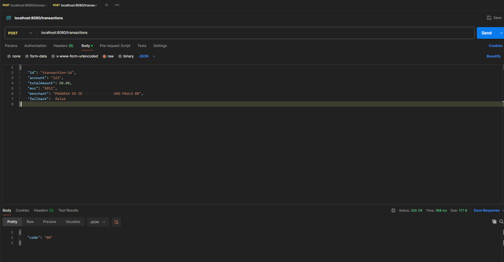
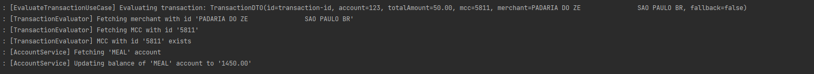

# transactions

## Dependências
- Docker Compose
- Java 17

## Rodando a aplicação
- Na pasta raiz do projeto, executar: `docker compose up -d`
- Executar a aplicação a patir da classe `TransactionsApplication`

## Exemplo de requisição

    `curl --location 'localhost:8080/transactions' \
    --header 'Content-Type: application/json' \
    --data '{
    "id": "transaction-id",
    "account": "123",
    "totalAmount": 50.00,
    "mcc": "5811",
    "merchant": "PADARIA DO ZE               SAO PAULO BR",
    "fallback":  false
    }'`

## Exemplo de requisição

Utilizar Optimistic Locking, adicionando o atributo "version" a cada registro da tabela account.
Quando duas transações tentam atualizar o mesmo registro simultaneamente, a transação que submete a atualização com um valor de version desatualizado será rejeitada.